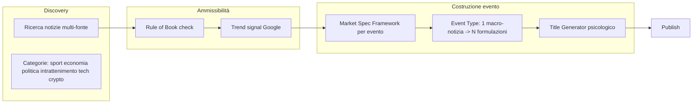

# Piano: sistema generazione eventi allineato al documento

Obiettivo: avere un sistema che rispetti i requisiti non negoziabili del PDF (rule of book, Market Specification Framework, trend signal, tipo mercato prima del titolo, titolo impattante, pubblico italiano/europeo), con chiarezza su **cosa c'è**, **cosa va aggiunto** e **cosa va settato meglio**. Nessun feedback loop; nessun codice in questa fase.

---

## 1. Flusso target (dal documento)

Ordine logico: **notizie** → **rule of book (ammissibilità)** → **trend signal** → **compilazione Market Specification Framework** → **scelta tipo mercato / N eventi da macro-notizia** → **titolo** → **publish**.

---

## 2. Cosa c'è già (mappatura)

| Requisito documento | Stato attuale |
|---------------------|---------------|
| **Ricerca notizie multi-fonte** | Parziale. Ingest: RSS media, RSS ufficiali, NewsAPI, Calendar ([lib/ingestion](lib/ingestion)). Discovery path: foundation-layer con registry/connectors. Manca integrazione esplicita "trend Google" e copertura mirata per sport (F1, MotoGP), intrattenimento, crypto/azioni come nel doc. |
| **Categorie (sport, economia, politica, tech, crypto, intrattenimento)** | Categorie presenti in prompt/config; non c'è un vincolo forte "solo queste" e non tutte le fonti sono allineate per categoria. |
| **Rule of Book (Golden Rule + checklist)** | Validazione tipo rule-of-book esiste su **candidato** già generato: [lib/event-gen-v2/rulebook-validator](lib/event-gen-v2/rulebook-validator) (binary, deadline, resolution source, timezone, title vs criteria, source hierarchy). **Manca:** rule of book come **criterio di ammissibilità sulla notizia grezza** (prima di generare candidato). |
| **Trend signal** | Non obbligatorio. Trend/score esistono (storyline momentum/novelty, trend detection da articoli). Nessun "Google Trends" esplicito come gate "deve esserci interesse minimo". |
| **Market Specification Framework (A–I)** | Non esiste come artefatto unico per evento. In DB: campi sparsi (marketId, resolutionCriteriaYes/No, resolutionCriteria, closesAt, resolutionSourceUrl, timezone, ecc.). In foundation: DeterministicRulebookCompiler genera rulebook con sezioni ma **non** è usato nella pipeline event-gen-v2 e **non** è persistito per evento né mostrato nella "i" della pagina evento. |
| **Tipo mercato / N eventi da macro-notizia** | Assente. Oggi: una notizia/storyline → uno (o pochi) candidati binari. Il doc chiede un blocco **antecedente** al title generator che da una macro-notizia produca più formulazioni (es. 100k SI/NO, 105k SI/NO, SOPRA/SOTTO 100k). Il modello Event è solo binario YES/NO; multi-outcome (X/Y) non è modellato. |
| **Titolo psicologicamente impattante** | Engine presente ([lib/psychological-title-engine](lib/psychological-title-engine)) ma usato solo nel path trend (`CANDIDATE_EVENT_GEN`), non in storyline né discovery. |
| **Pubblico italiano/europeo** | Parziale: lingua/config italiani, whitelist domini Italia; non c'è una policy esplicita "tutte le notizie devono essere adatte a pubblico italiano/europeo" come gate. |
| **Publish** | Presente: `publishSelectedV2` crea Event in DB. |

---

## 3. Cosa va aggiunto

- **Pre-validazione rule of book sulla notizia/evento grezzo**  
  Modulo che, dato il corpo notizia (e metadati: fonte, data), risponda "può soddisfare il rule of book?" **prima** di generare titolo/criteri. Solo le notizie che passano entrano in generazione. Ti basta che la notizia risponda al rule of book come criterio di ammissibilità sulla notizia grezza (senza richiedere allineamento esplicito alle 10 sezioni del doc).

- **Trend signal come gate obbligatorio**  
  Dopo il rule-of-book check: verificare che esista un minimo interesse (es. Google Trends o equivalente) per la notizia/evento. Se sotto soglia, scartare. Definire soglia e fonte (API/connector).

- **Market Specification Framework come artefatto per evento**  
  Per ogni evento pubblicato: generare e **salvare** il documento "Market Specification" (sezioni A–I del doc). Questo implica: (1) definire il formato (testo strutturato o JSON) e dove salvarlo (campo su Event o tabella dedicata); (2) usare/estendere il RulebookCompiler o un generatore dedicato per compilare A–I a partire da candidato/evento; (3) esporre questo contenuto nella "i" informativa della pagina evento ([app/events/[id]/page.tsx](app/events/[id]/page.tsx)).

- **Blocco "Event Type / Market Type" prima del titolo**  
  Da una **macro-notizia** (es. "BTC/ORO/X ai massimi storici"): (1) interpretare la notizia; (2) decidere **come** spezzarla in uno o più mercati (es. 100k SI/NO, 105k SI/NO, 120k SI/NO oppure SOPRA 100K / SOTTO 100K); (3) uscita = N "formulazioni" di evento (ognuna con propria domanda, soglie, esiti). Questo blocco deve essere **antecedente** al title generator. Richiede: modellazione multi-outcome se si vogliono mercati X/Y (oltre YES/NO); logica o LLM per "splitting" e scelta tipo mercato.

- **Titolo psicologicamente impattante su tutti i path**  
  Usare il Psychological Title Engine in **tutti** i path (storyline, trend, discovery-backed), dopo la generazione delle formulazioni e prima del publish, come titolo finale dell'evento.

- **Policy "pubblico italiano/europeo"**  
  Gate esplicito: ogni notizia/evento deve essere giudicato adatto a pubblico italiano/europeo (lingua, rilevanza, fonti). Può essere parte del rule-of-book check o step separato dopo discovery.

---

## 4. Cosa va settato meglio

- **CRON e fonti**  
  Far sì che il cron di generazione eventi **chiami** la lettura fonti (ingest o discovery) prima di generare, così il flusso "cron attiva generazione" e "generazione richiama le fonti" è unico. Verificare che le fonti coprano le categorie del doc (sport calcio/basket/tennis/F1/MotoGP, economia, politica, intrattenimento, scienza/tech, crypto/azioni) e che siano prioritarie fonti ufficiali / wire / reputabili come da doc.

- **Rulebook validator**  
  L'eventuale pre-validazione sulla notizia grezza deve verificare che la notizia possa rispondere al rule of book come criterio di ammissibilità (senza richiedere allineamento esplicito alle 10 sezioni). Il validator su candidato ([lib/event-gen-v2/rulebook-validator](lib/event-gen-v2/rulebook-validator)) resta per il controllo sul candidato già generato.

- **Categorie**  
  Vincolare le categorie agli assi del doc: Politics, Sports, Tech, Crypto, Economy, Culture (e/o intrattenimento). Mappare e filtrare fonti/eventi per categoria in modo coerente.

- **Ordinamento pipeline**  
  L'ordine desiderato è: **validazione rule of book (su notizia)** → **trend signal** → **generazione Market Spec Framework per evento** → **Event Type (N formulazioni da macro-notizia)** → **Title Generator** → **Publish**. Oggi l'ordine è diverso (es. candidato → validazione → score → publish; titolo solo in un path). Va ridisegnato l'ordine degli step e dove s'inseriscono i nuovi blocchi.

---

## 5. Dipendenze e priorità logiche

1. **Rule of Book (ammissibilità)** e **Trend signal** sono prerequisiti per considerare una notizia "approvabile"; vanno prima di qualsiasi generazione di evento.
2. **Market Specification Framework** e **Event Type / N eventi da macro-notizia** sono centrali: il primo definisce cosa mostri nella "i"; il secondo definisce quante e quali "domande" si creano da una notizia. Entrambi vanno prima del titolo.
3. **Titolo** viene dopo che si è deciso tipo mercato e formulazioni (una titolazione per ogni formulazione).
4. **Multi-outcome (X/Y)** richiede estensioni di schema DB, risoluzione e UI; può essere introdotto in fase successiva se si vuole supportare "SOPRA 100K / SOTTO 100K" come due esiti invece di due mercati binari separati.

---

## 6. Riepilogo azioni (senza codice)

- **Aggiungere:** pre-validazione rule of book su notizia grezza (criterio di ammissibilità, senza allineamento alle 10 sezioni); gate trend signal (Google o equivalente); generazione e persistenza Market Specification Framework (A–I) per evento e sua visualizzazione nella "i"; blocco Event Type / Market Type (N formulazioni da macro-notizia) prima del title generator; uso del Psychological Title Engine su tutti i path; policy pubblico italiano/europeo.
- **Settare meglio:** collegamento cron → fonti; pre-validazione notizia che verifichi ammissibilità rule of book; copertura fonti e categorie (sport, economia, politica, intrattenimento, tech, crypto); ordinamento pipeline come nel flusso target.
- **Decidere:** se multi-outcome (X/Y) va modellato come tipo di mercato distinto o come N mercati binari (es. SOPRA/SOTTO = due mercati SI/NO); dove e come memorizzare il Market Specification (campo testo, JSON, o tabella dedicata).

Questo piano non include feedback loop e si limita a modifica/affinamento e chiarezza esistente/gap/setting come richiesto.
